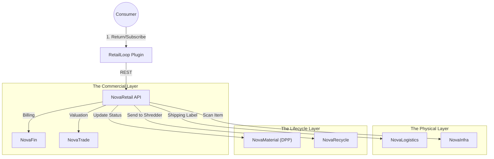

# 🛍️ NovaRetail

> **The Operating System for Circular Commerce.**
> Enabling Product-as-a-Service (PaaS), rental models, automated take-back schemes, and second-life inventory management.

[](https://www.google.com/search?q=https://github.com/novaeco-tech/novaretail/actions)
[](https://opensource.org/licenses/MIT)
[](https://www.google.com/search?q=https://retail.novaeco.tech)

**NovaRetail** is the Vertical Sector dedicated to the **Usage Phase** of the product lifecycle. While `NovaMake` builds the object and `NovaTrade` prices it, **NovaRetail** manages the relationship between the Brand and the User over time.

It provides the backend infrastructure for the shift from **Ownership** to **Access** (Leasing/Rentals) and manages the complex flows of getting products *back* from consumers.

-----

## 🎯 Value Proposition

The linear retail model ("Sell and Forget") is dying. **NovaRetail** powers the new circular business models:

1.  **Product-as-a-Service (PaaS):** Managing subscriptions for physical goods (e.g., "Jeans-as-a-Service," "Washing Machine Leasing").
2.  **Automated Take-Back:** Removing the friction of returns so that brands can recover valuable feedstock for `NovaRecycle`.
3.  **Resale Management:** Grading returned items to decide their fate: Resell (High Value) vs. Repair (`NovaTronix`) vs. Recycle (`NovaRecycle`).

-----

## 🏗️ Architecture (The Reverse Supply Chain)

NovaRetail acts as the state manager for individual item instances (Serial Numbers/SKUs) as they move between users and warehouses.



### Integrated Services

  * **[NovaFin](https://www.google.com/search?q=https://finance.novaeco.tech):** Handles recurring billing for subscriptions and instant payouts/credits for trade-ins.
  * **[NovaLogistics](https://www.google.com/search?q=https://logistics.novaeco.tech):** Generates QR-code shipping labels for returns. It treats consumer homes as "Distributed Warehouses."
  * **[NovaMaterial](https://www.google.com/search?q=https://materials.novaeco.tech):** Updates the Digital Product Passport (DPP). When a user returns a jacket, NovaRetail updates the DPP status from "In Use" to "In Grading."
  * **[NovaTrade](https://www.google.com/search?q=https://trade.novaeco.tech):** Provides dynamic pricing. If a user wants to return a phone, NovaRetail asks NovaTrade: "What is the current market price for an iPhone 12 in 'Fair' condition?"

-----

## ✨ Key Features

### 1\. Subscription Engine (Leasing)

Tracks "Who has what."

  * **Asset Tracking:** Links a specific Serial Number to a specific User ID (`NovaAuth`).
  * **Lifecycle Events:** Handles "Pause Subscription," "Upgrade Model," and "Report Lost."
  * **Depreciation Logic:** Calculates the residual value of the asset every month.

### 2\. The "Triage" Logic

When an item arrives at the warehouse, NovaRetail decides its destiny based on rules:

  * **Condition:** Grade A (Like New) -\> **Resell** on `NovaTrade`.
  * **Condition:** Grade B (Functional but ugly) -\> **Rent** at discount.
  * **Condition:** Grade C (Broken) -\> Send to **Repair** (`NovaTronix`).
  * **Condition:** Grade F (End of Life) -\> Send to **Recycling** (`NovaRecycle`).

### 3\. Incentivized Returns

Behavioral psychology for the circular economy.

  * Configures "Deposit Return Schemes" (DRS) for non-packaging items (e.g., a €10 deposit on a sneaker).
  * Triggers automatic refund via `NovaFin` when the `NovaInfra` scanner confirms the item has arrived at the hub.

### 4\. Second-Life Inventory

Creates a shadow inventory system for used goods.

  * Automatically generates listings for refurbished items.
  * Pushes these listings to the `RetailLoop` plugin so they appear on the brand's main e-commerce site alongside new items.

-----

## 🚀 Getting Started

We use **DevContainers** to provide a consistent development environment.

### Prerequisites

  * Docker Desktop
  * VS Code (with Remote Containers extension)

### Installation

1.  **Clone the repo:**
    ```bash
    git clone https://github.com/novaeco-tech/novaretail.git
    cd novaretail
    ```
2.  **Open in VS Code:**
      * Run `code .`
      * Click **"Reopen in Container"** when prompted.
3.  **Start the Sector:**
    ```bash
    make dev
    ```
      * **Admin Dashboard:** http://localhost:3000 (For warehouse managers)
      * **API:** http://localhost:8000/docs

### Configuration (`.env`)

```ini
# Business Logic
DEFAULT_LEASE_DURATION_MONTHS=12
DEPRECIATION_MODEL=LINEAR # or ACCELERATED
AUTO_LIST_RESALE=true

# Integrations
NOVAFIN_URL=http://novafin-api:8000
NOVALOGISTICS_URL=http://novalogistics-api:8000
```

-----

## 📂 Repository Structure

This is a Monorepo containing the sector's specific logic.

```text
novaretail/
├── api/                # Python/FastAPI (Domain Logic)
│   ├── src/
│   │   ├── subscriptions/ # Recurring billing & asset assignment
│   │   ├── triage/        # Grading logic (Resell vs Recycle)
│   │   └── pricing/       # Dynamic buy-back calculator
├── app/                # React/Next.js Frontend (Warehouse/Admin UI)
│   ├── src/
│   │   ├── warehouse/     # Scanning interface for returned items
│   │   └── inventory/     # Second-life stock management
├── website/            # Documentation (Docusaurus)
└── tests/              # Integration tests
```

-----

## 🧪 Testing

We use **Lifecycle Simulation** for testing.

  * **Subscription Flow:** `make test-lease`
      * Simulates a User signing up -\> Monthly Charge -\> Return -\> Deposit Refund.
  * **Triage Logic:** `make test-triage`
      * Inputs an item with "Broken Zipper." Asserts that the system routes it to `NovaTextile` (Repair) and *not* `NovaRecycle` (Shredder).

-----

## 🤝 Contributing

We need contributors with backgrounds in **E-commerce**, **Reverse Logistics**, and **Fintech**.
See [CONTRIBUTING.md](https://www.google.com/search?q=../.github/CONTRIBUTING.md) for details.

**Maintainers:** `@novaeco-tech/maintainers-sector-novaretail`